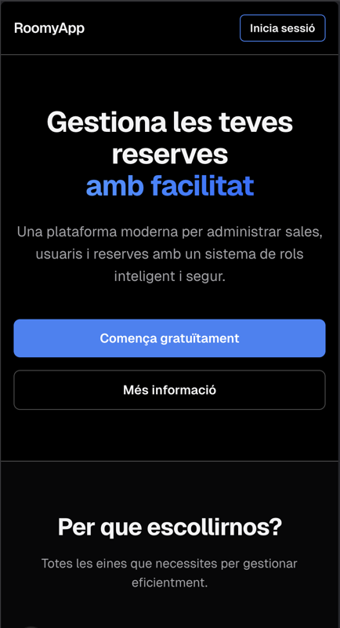
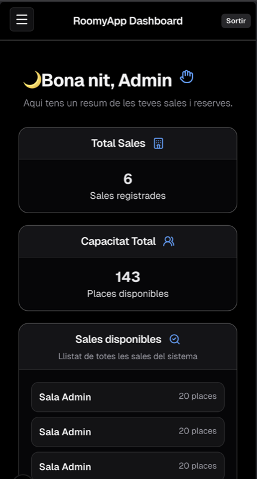

# RoomyApp Frontend

Aplicació web de gestió de reserves de sales. Solució completa amb autenticació segura i panells de control per a administradors i empleats.

## Descripció del Projecte

RoomyApp Frontend és una aplicació de gestió de reserves de sales desenvolupada amb Next.js, TypeScript i Tailwind CSS. Permet als administradors gestionar sales, usuaris i reserves, mentre que els empleats visualitzen el seu dashboard personalitzat.

**Versió:** 0.1.0  
**Estat:** Producció  
**Última actualització:** 10 d'abril de 2026

---

## Stack Tecnològic

- **Next.js** 16.2.1 - Framework React amb SSR/SSG
- **React** 19 - Biblioteca UI
- **TypeScript** 5.x - Llenguatge tipat
- **Tailwind CSS** v4 - Framework CSS utilitari
- **Jest** 29.x - Testing framework
- **ESLint** 9.x - Qualitat de codi

**Característiques:**
- Autenticació JWT segura
- Routing avançat amb App Router
- Tests unitaris
- TypeScript strict mode
- Responsive design
- Dark mode support

---

## Prerequisits

Necessites tenir instal·lat:

- Node.js versió 18+ (recomanat LTS)
- npm versió 9+
- Git
- Backend Spring Boot actiu a `http://localhost:8080`
- PostgreSQL connectat al backend

---

## Configuració

### Pas 1: Clonar i Instal·lar

```bash
git clone https://github.com/nlgarcia84/reservesapp-frontend.git
cd reservesapp-frontend
npm install
```

### Pas 2: Variables d'Entorn

Crea el fitxer `.env.local`:

```bash
cp .env.example .env.local
```

Edita `.env.local` amb:

```
NEXT_PUBLIC_API_URL=http://localhost:8080
```

Les variables amb prefixe `NEXT_PUBLIC_*` es publiquen al navegador, així que no hi posis secrets.

### Pas 3: Arrencar

```bash
npm run dev
```

L'aplicació estarà disponible a http://localhost:3000

---

## Credencials de Prova

| Rol | Email | Contrasenya |
|-----|-------|------------|
| Admin | `admin@roomyapp.cat` | `admin123` |
| Empleat | `employe@roomyapp.cat` | `employe123` |

---

## Scripts Disponibles

```bash
npm run dev         # Servidor desenvolupament (localhost:3000)
npm run build       # Build optimitzada de producció
npm run start       # Servidor en mode producció
npm run lint        # Verifica qualitat de codi
npm run test        # Executa tests
npm run test:watch  # Tests en mode watch
```

---

## Estructura del Projecte

```
reservesapp-frontend/
├── app/
│   ├── (auth)/                      # Rutas autenticació
│   │   ├── login/page.tsx
│   │   ├── signup/page.tsx
│   │   └── layout.tsx
│   ├── (landing)/                   # Landing pública
│   │   └── page.tsx
│   ├── dashboard/
│   │   ├── admin/                   # Panell admin
│   │   │   ├── page.tsx
│   │   │   ├── gestio-sales/
│   │   │   ├── gestio-usuaris/
│   │   │   └── gestio-reserves/
│   │   └── employee/                # Panell empleat
│   │       ├── page.tsx
│   │       └── layout.tsx
│   ├── hooks/
│   │   ├── useAuth.ts
│   │   ├── useLoadingState.ts
│   │   └── useTimeGreeting.ts
│   ├── services/
│   │   ├── auth.ts
│   │   ├── rooms.ts
│   │   ├── users.ts
│   │   └── saveToken.ts
│   └── utils/
│       └── avatar.ts
├── components/
│   ├── admin/
│   ├── employee/
│   ├── layout/
│   └── ui/
├── public/
│   └── images/
├── .env.example
├── .env.local
├── .env.production
├── jest.config.mjs
├── next.config.ts
├── tsconfig.json
└── package.json
```

---

## Captures de Pantalla

### Panell d'Administrador


Sistema complet de gestió amb accés a sales, usuaris i reserves.

### Panell d'Empleat


Interfície personalitzada pel personal amb informació rellevant.

---

## API Backend

El backend Spring Boot ha de proporcionar els següents endpoints:

```
POST   /auth/login              → { token, role, name }
GET    /rooms                   → Llista de sales
POST   /rooms                   → Crear sala (admin)
DELETE /rooms/{id}              → Eliminar sala (admin)
GET    /users                   → Llista usuaris (admin)
POST   /users                   → Crear usuari (admin)
DELETE /users/{id}              → Eliminar usuari (admin)
GET    /reserves                → Llista reserves
POST   /reserves                → Crear reserva
DELETE /reserves/{id}           → Cancelar reserva
```

---

## Seguretat

- JWT Authentication: Tokens signats per a cada sessió
- Role-based Access: Admin i Employee amb permisos específics
- Protected Routes: RoleGuard component limita accés
- Secure Token Storage: localStorage amb opció "Recorda'm"
- CORS Configuration: Backend configurat per acceptar el frontend

---

## Guia d'Ús

### Per als Professors

1. Clona el repositori
   ```bash
   git clone https://github.com/nlgarcia84/reservesapp-frontend.git
   ```

2. Instal·la les dependències
   ```bash
   npm install
   ```

3. Assegura't que el `.env.local` té:
   ```
   NEXT_PUBLIC_API_URL=http://localhost:8080
   ```

4. Verifica que el backend Spring Boot corre a puerto 8080

5. Arrenca el frontend:
   ```bash
   npm run dev
   ```

6. Obrir http://localhost:3000 i fer login amb les credencials de prova

### Arquitectura del Sistema

```
Frontend (React)           Backend (Spring Boot)      Database (PostgreSQL)
Port 3000                  Port 8080                  Supabase
    │                           │                          │
    ├──► HTTP REST ──────────►  ├──► JDBC/SQL ──────────► │
    │    (JWT Auth)             │                          │
    │                           │                          │
    └────────────────────────────────────────────────────── │
```

---

## Recursos

- [Next.js Documentation](https://nextjs.org/docs)
- [React Documentation](https://react.dev)
- [TypeScript Handbook](https://www.typescriptlang.org/docs)
- [Tailwind CSS Docs](https://tailwindcss.com/docs)
- [Jest Documentation](https://jestjs.io)

---

## Solucionar Problemes

| Problema | Solució |
|----------|---------|
| `Failed to fetch` | Verifica que el backend corre a `localhost:8080` |
| `CORS Error` | El backend necessita `allowedOriginPatterns` configurat |
| `Invalid Token` | Verifica el JWT token al localStorage |
| `Port 3000 in use` | Tanca l'altra instància: `lsof -i :3000` → `kill -9 <PID>` |

---

Per a dubtes o problemes, obrir un Issue al repositori.
